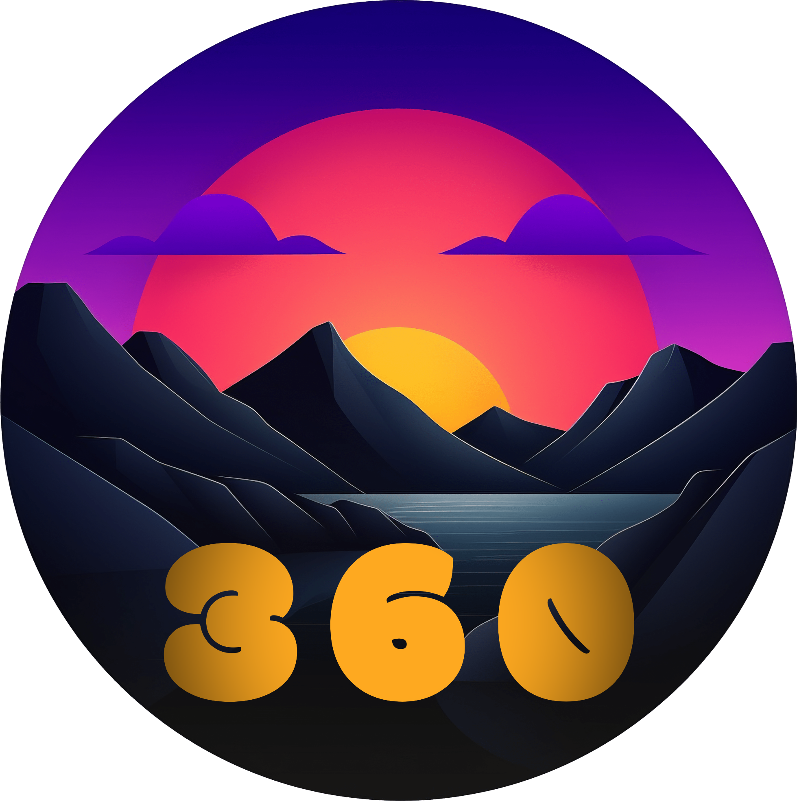

# README pour l'extension "365-daynight-vscode-theme-ext"

Bienvenue sur la page README de l'extension "365-daynight-vscode-theme-ext" pour VSCode. 

365DayNight VSCode Themes est une extension visant à améliorer votre expérience de codage tout au long de l'année avec des thèmes dynamiques visuellement enrichissants. Conçue pour minimiser la fatigue oculaire et optimiser la lisibilité, 365DayNight adapte votre thème VSCode selon la lumière naturelle ou artificielle, et offre une expérience de codage ininterrompue 24/7.

## Caractéristiques

365DayNight offre des thèmes de codage pour le jour et la nuit, et comprend des thèmes spéciaux pour les périodes de fêtes. Les avantages de cette extension sont :

- Deux thèmes orientés pour la lumière naturelle pendant la journée et la lumière artificielle pendant la nuit.
- Minimise la fatigue oculaire et maximise la lisibilité.
- Adapte automatiquement votre thème en fonction du moment de la journée.
- Thèmes spéciaux pour les périodes de fêtes.

## Paramètres de l'Extension 

L'extension offre les paramètres suivants :

* `365DayNight.enable`: Activer/désactiver l'extension.
* `365DayNight.mode`: Définir le mode à `jour`, `nuit` ou `auto` pour un changement automatique.

## Accessibilité

Nous accordons une grande importance à l'accessibilité et nous avons optimisé l'extension pour être plus accessible, notamment pour les personnes atteintes de daltonisme. Si vous avez des suggestions ou des idées pour améliorer l'accessibilité, n'hésitez pas à nous faire part de vos commentaires.

## Notes de Version

Les détails de chaque version sont fournis ci-dessous :

### 1.0.0

Version initiale de 365DayNight.

### 1.0.1

Correction de bugs mineurs.

### 1.1.0

Ajout de thèmes spéciaux pour les fêtes.

---

## Pour Plus d'Informations

Pour plus d'informations sur l'utilisation du MarkDown dans Visual Studio Code, consultez les liens suivants :

* [Support de Markdown de Visual Studio Code](http://code.visualstudio.com/docs/languages/markdown)
* [Référence de la Syntaxe Markdown](https://help.github.com/articles/markdown-basics/)

Profitez de la flexibilité et de la dynamique de l'extension 365DayNight pour une expérience de codage enrichissante !

**Amusez-vous bien avec l'extension 365DayNight VSCode Themes!**
